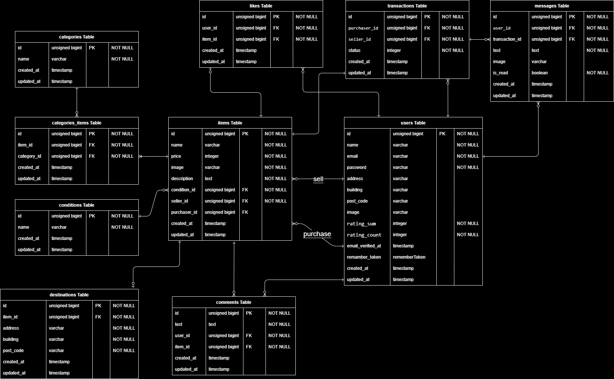

# coachtechフリマ

## 環境構築
Dockerビルド
1. git clone git@github.com:ST0724/flea-market-pro.git
2. docker-compose up -d --build

Laravel環境構築
1. docker-compose exec php bash
2. composer install
3. cp .env.example .env
4. .envファイルの環境変数を適宜変更
5. php artisan key:generate
6. php artisan migrate
7. php artisan db:seed
8. php artisan storage:link

## 使用技術(実行環境)
+ Laravel 8.83.8

## テストアカウント
name:テストユーザー1   
email:test1@example.com  
password:test_user1  

name:テストユーザー2   
email:test2@example.com  
password:test_user2  

name:テストユーザー3   
email:test3@example.com  
password:test_user3  

## ER図

## URL
開発環境：[http://localhost/](http://localhost/)